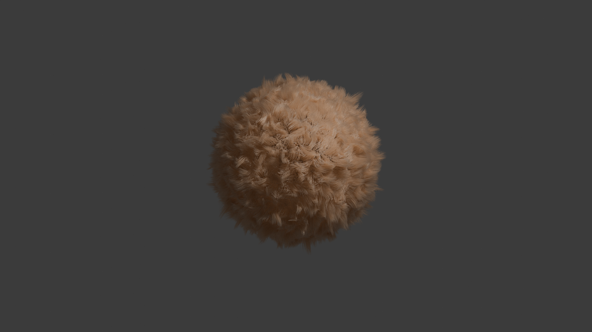

# FUR with Blender - particle system method

[ (click to view)](https://www.youtube.com/watch?v=TnmCOeqfZ5o)

- add uv sphere
- right panel -> partical properties -> + add particle system slot
- select hair option
- emission -> adjust hairlength (0.1m)
- emission -> source -> turn off even distribution 
- emission -> source -> increase particles / face
- select advanced (on)
- turn on hair dynamics 
- hair dynamics -> structure -> stiffness (lower) 
- hair dynamics -> volume -> air drag (higher) gets affected by wind less
- physics -> forces -> brownian -> 0.1
- children -> interpolated -> display amount: 50
- children -> interpolated -> render amount: 50 
- children -> clumping -> 0.194
- cache -> simulation end -> 90
- cache -> bake
- material -> new material -> surface -> principled hair bsdf
- material -> roughness (increase)
- material -> color 

## results
